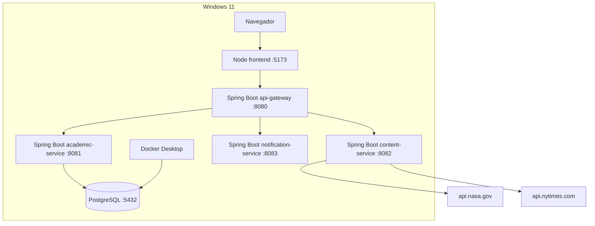

# Arquitectura fisica

## Componentes desplegados

| Componente | Puerto | Ejecucion |
| --- | ---: | --- |
| frontend | 5173 | `npm run dev` |
| api-gateway | 8080 | `.\mvnw.cmd -pl services/api-gateway spring-boot:run` |
| academic-service | 8081 | `.\mvnw.cmd -pl services/academic-service spring-boot:run` |
| content-service | 8082 | `.\mvnw.cmd -pl services/content-service spring-boot:run` |
| notification-service | 8083 | `.\mvnw.cmd -pl services/notification-service spring-boot:run` |
| PostgreSQL | 5432 | `docker compose up -d` |

## Base de datos

PostgreSQL se ejecuta en Docker Compose. No se requiere instalar PostgreSQL ni cliente `psql` en Windows.

`academic-service` usa la base `ups_gerencia` con credenciales configurables por variables de entorno.

## Servicios externos

- NASA API: consultada por `content-service`.
- NYTimes API: consultada por `content-service`.

Si las claves no estan configuradas o no hay internet, `content-service` devuelve recursos demo controlados.

## Docker Compose

El archivo `docker-compose.yml` levanta PostgreSQL, una red interna y un volumen persistente. Los servicios backend se ejecutan localmente con Maven Wrapper para mantener la ejecucion simple en Windows.

## Diagrama fisico

