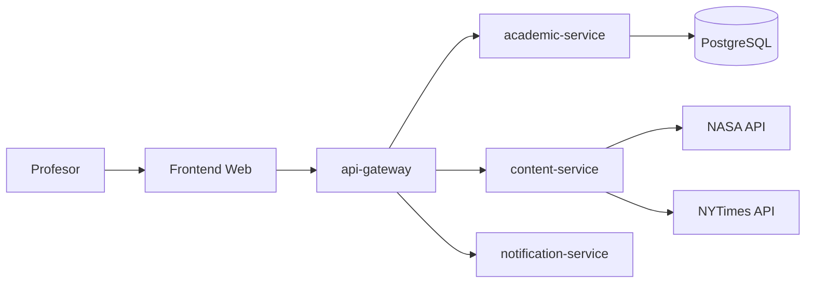

# Arquitectura logica

## Capas

- Presentacion: `frontend`, aplicacion web HTML/CSS/JavaScript servida con Node.js.
- Orquestacion: `api-gateway`, punto unico de entrada para el frontend.
- Servicios de negocio: `academic-service`, `content-service`, `notification-service`.
- Persistencia: PostgreSQL usado por `academic-service`.
- Proveedores externos: NASA API y NYTimes API.

## Servicios y responsabilidades

- `api-gateway`: recibe solicitudes del frontend, ejecuta el proceso completo, consolida respuesta y evita que el frontend conozca proveedores internos o externos.
- `academic-service`: administra profesores, estudiantes, asignaturas y solicitudes academicas. Valida reglas academicas.
- `content-service`: encapsula la integracion con NASA y NYTimes. Maneja claves, errores y fallback.
- `notification-service`: simula envio de notificaciones y devuelve evidencia.
- `frontend`: interfaz web para profesores.

## Comunicacion

- REST sobre HTTP.
- Mensajes JSON.
- Variables de entorno para URLs y claves.
- El frontend solo consume `api-gateway`.
- `api-gateway` consume servicios internos.
- `content-service` consume APIs externas.

## Diagrama logico

## Justificacion SOA

El sistema separa capacidades en servicios autonomos con contratos REST: validacion academica, obtencion de contenido, notificacion y orquestacion. Cada proveedor tiene una responsabilidad clara y se comunica mediante interfaces HTTP/JSON. El proceso de negocio se compone mediante servicios, no mediante llamadas directas del frontend a APIs externas.
